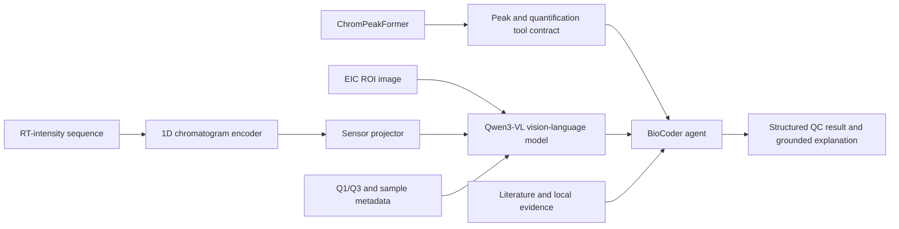

# BioCoder × ChromPeakFormer Multimodal Roadmap

Status: Phase A manifest audit, Phase A-plus group splitting, the complete train-plus-validation
ROI/XIC/COCO build, and unified 160-point Dataset materialization are verified. The sequence
training runner, independent run validator, and Qwen3-VL instruction/evaluation builder are
implemented. Instruction materialization, internal-test extraction, completed model runs, and
benchmark results are not yet complete.

## Verified Phase A snapshot

The first authorized raw-data audit produced dataset version `raw-072fee8e`:

- 134 unique mzML files; all contain chromatogram signals.
- 18,125 primary eligible label records and 132 isolated alternate-label records.
- 14,175 positive and 3,950 negative eligible records across 173 components.
- 25 older mzML files carry recoverable text-encoding warnings; zero files are structurally empty.
- Repeated generation produced the same manifest SHA-256, confirming deterministic output.

The raw files and generated manifest remain outside Git. The implementation and synthetic contract
tests are maintained under `backend/multimodal_science/` and `backend/tests/unit/`.

## Verified Phase A-plus snapshot

The leakage-resistant split for `raw-072fee8e` produced:

- 87 train, 11 validation, and 11 internal-test source mzML groups from `traindata3`;
- 14,355 train, 1,815 validation, and 1,815 internal-test label records;
- zero split-group overlap, zero content-hash overlap, and zero audit contamination;
- 8 negative-only auxiliary training records, 132 historical external records, and 132 isolated
  alternate-label audit records; and
- deterministic split-manifest SHA-256
  `30554291c68f7bc32fb7b7c9a954146a02c61cac8ed687aea75ab0cac376cd44`.

The manifest-driven ChromPeakFormer preflight then verified all 134 mzML source hashes and produced
128 label-driven jobs plus 6 inference-only unlabelled jobs. Its current deterministic plan
SHA-256 is `50c1770f77c38d94e141279317d1eaddacf299bf3d199a8e06859792a33ae5f1`.

The execution boundary re-verifies source hashes, stages every job in
isolation, validates CSV/JPEG/NPY cross-file consistency, publishes only through an atomic rename,
and records structured failure provenance.

## Verified ROI/XIC/COCO snapshot

The authorized CPU extraction run completed all selected train and validation source groups:

- 98/98 source jobs indexed: 87 train and 11 validation, with zero missing jobs;
- 16,170 aligned ROI image and XIC-sequence assets: 14,355 train and 1,815 validation;
- 12,679 positive assets and 3,491 negative assets;
- 12,679 COCO peak annotations, while negative ROIs remain annotation-free images; and
- deterministic asset-index SHA-256
  `7afaa48069007458d02ccc1507fb778ec193cab3aad3cbca88d3f608e19b3c0f`.

The build reused five previously verified cache entries and completed the other 93 selected jobs,
with zero failures and zero staging directories left behind. These counts prove aligned asset
generation; they are not model-quality or scientific benchmark results. Generated assets and
absolute execution paths remain outside Git.

The subsequent training-readiness gate passed with no warnings. It confirmed 165 components in
both train and validation, zero validation-only components, and a train-versus-validation positive
rate gap of `0.008783`. Its deterministic report SHA-256 is
`5027330265672012b4bc6302187c772014d87bb22f15ba29a890c67ef1e113b4`. This report is bound to the
asset-index hash above.

The v2 numerical preflight then verified all 16,170 ROI crops across 98 XIC matrices. The unified
Dataset materializer interpolated each crop on its true RT coordinates to 160 points and atomically
published aligned signals, scalar features, targets, and example provenance. Its report SHA-256 is
`3be8edfe8d8bcc4cf0c2c09374a518e001008831d792d452728cf6a6c160b1b5`; the Dataset remains bound to
the asset-index hash above. This is model-ready data evidence, not a trained-model result.

## Objective

Extend BioCoder with a reproducible LC-MS scientific multimodal workflow. The planned system will combine extracted-ion chromatogram images, RT-intensity sequences, transition and sample metadata, a specialist chromatographic peak detector, and a domain-adapted Qwen3-VL model.

The target output is not free-form image description. It is a traceable scientific result containing peak status, boundaries, quantitative measurements, quality-control decisions, supporting evidence, uncertainty, and a natural-language explanation.

## Design principles

1. Evidence and provenance take priority over model fluency.
2. Precise peak localization remains the responsibility of a specialist detector.
3. Qwen3-VL must be trained and evaluated as a domain model; API-only integration is a baseline, not the final system.
4. Multimodal improvement must be demonstrated through ablations and leakage-resistant evaluation.
5. Claims in documentation and resumes must be traceable to reproducible run artifacts.

## Proposed architecture

`ChromPeakFormer` is the public project name for the existing in-company specialist peak-detection foundation. The multimodal work adds explicit data contracts, domain adaptation, signal fusion, agent orchestration, scientific evaluation, and reproducible evidence artifacts.

## Scope

In scope:

- Manifest-first alignment of ROI images, numerical chromatograms, metadata, labels, and source files.
- Leakage-resistant train, validation, test, and audit partitions.
- A typed peak-analysis tool contract with explicit scientific states.
- A credible tool-based BioCoder demonstration before model-training claims are made.
- Qwen3-VL-8B LoRA training on verified multimodal instruction data.
- A trainable 1D chromatogram encoder and sensor projector.
- Scientific and agent evaluation tracks with a joint model-promotion gate.
- Model cards, experiment reports, and traceable public claims.

Out of scope:

- Unknown-compound identification.
- Molecular structure elucidation or generation.
- Clinical diagnosis or treatment recommendations.
- Using Qwen3-VL as the primary high-precision peak-boundary regressor.
- Presenting unverified historical results as newly reproduced results.

## Delivery gates

### Phase 0 — Naming and provenance

- Use `ChromPeakFormer` consistently in public project interfaces and documents.
- Document the boundary between the existing company detector and new multimodal contributions.

### Phase A-plus — Contract freeze

Freeze the following contracts before model or UI work proceeds:

- Dataset manifest and eligibility rules.
- Split-group and audit-bucket rules.
- Tool status and provenance schema.
- Scientific and agent report schemas.
- Registry evidence and promotion rules.

### Phase 1 — Independent HF/CUDA substrate

Create a dedicated multimodal training and scientific-evaluation path. It may reuse BioCoder run metadata, serving, trajectory, and model-registry conventions, but it must remain separate from the current text/MLX SFT executor.

### Phase 2 — Manifest-first eligibility

Each example must have an immutable sample identity and traceable mappings to its image, numerical sequence, metadata, label source, and original experiment.

Required eligibility fields include:

- `sample_id`
- `source_mzml`
- `source_row`
- `artifact_hash`
- `match_strategy`
- `fallback_order`
- `train_eligible`
- `benchmark_eligible`
- `audit_bucket`
- `split_group`

Fallback or weakly aligned samples may be retained for diagnosis, but they cannot enter the primary training set or benchmark.

### Phase 3 — Leakage-resistant splitting

- Group samples by original experiment or source file before splitting.
- Prevent related ROI images and negative samples from crossing partitions.
- Report eligible and audit populations separately.

### Phase 4 — Scientific tool contract

The peak-analysis tool will distinguish at least:

- `ok`
- `no_peak`
- `qc_reject`
- `no_channel`
- `tool_error`

Every response must carry a reason code, tool stage and version, sample identity, evidence paths, and measurement provenance. A zero-valued measurement must never be used as a substitute for an explicit status.

### Phase 5 — B1 credible demonstration

Integrate ChromPeakFormer with the BioCoder agent and return schema-valid peak, area, QC, evidence, and trajectory results. This milestone demonstrates tool orchestration only; it must not be described as completed Qwen3-VL domain training.

### Phase 6 — Multimodal instruction builders

Build verified tasks for:

- Peak presence and peak count.
- Quality-control classification.
- Quantifier/qualifier channel consistency.
- Tool-selection decisions.
- Evidence-grounded explanations.
- Correct abstention when evidence is insufficient.

Supervision must come from human labels, deterministic rules, or verified tool output.

### Phase 7 — B2 Qwen3-VL and signal fusion

Run the following sequence:

1. Zero-shot and few-shot baselines.
2. Qwen3-VL-8B domain LoRA.
3. LoRA with a 1D chromatogram encoder and sensor projector.
4. Optional small-learning-rate visual adaptation only if validation evidence supports it.

The primary training target is BF16 LoRA on three 48 GB GPUs. QLoRA is a fallback, not the default target.

### Phase 8 — Dual-track evaluation

Scientific evaluation:

- Detection precision, recall, and F1 under declared RT tolerances.
- Start/end boundary error.
- Peak-area R² and RSD.
- Blank-sample false positives.
- Modality and tool ablations.

Agent evaluation:

- Tool-selection accuracy.
- QC accuracy.
- Abstention correctness.
- Structured-output validity.
- Explanation faithfulness.
- Evidence-attribution completeness.

A candidate cannot be promoted without both scientific and agent evidence.

### Phase 9 — Reproducible public artifacts

- Dataset and split summaries without unauthorized raw data.
- Training configurations and run metadata.
- Model card and limitations.
- Scientific and agent evaluation reports.
- Failure-case and ablation analyses.

## Acceptance criteria

| ID | Requirement |
|---|---|
| AC-01 | Public naming is consistently `ChromPeakFormer`, with clear provenance and contribution boundaries. |
| AC-02 | Multimodal HF/CUDA training and scientific evaluation are separated from the text/MLX SFT executor. |
| AC-03 | Every training or benchmark example has a validated, explainable eligibility record. |
| AC-04 | The primary benchmark passes split-overlap and audit-contamination checks. |
| AC-05 | Tool results use the typed status and provenance contract before UI integration. |
| AC-06 | The B1 demonstration runs end to end without claiming uncompleted model training. |
| AC-07 | Multimodal builders cover the declared task families and reject audit-only samples. |
| AC-08 | At least one Qwen3-VL LoRA run and one LoRA-plus-projector run produce traceable artifacts. |
| AC-09 | Scientific and agent reports are both present and consumed by the registry evidence gate. |
| AC-10 | Every public metric can be traced to a dataset version, configuration, and evaluation artifact. |

The corresponding verification matrix is maintained in [MULTIMODAL_TEST_PLAN.md](MULTIMODAL_TEST_PLAN.md).
