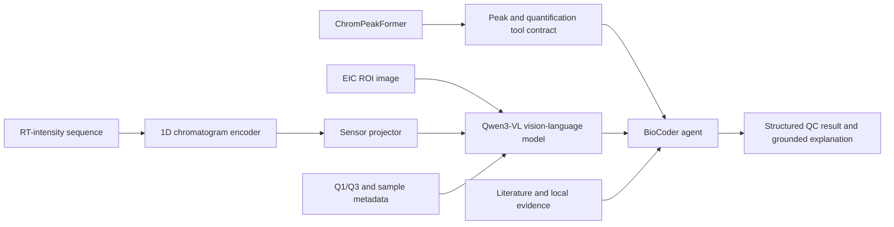

# BioCoder × ChromPeakFormer Multimodal Roadmap

Status: Phase A manifest audit, Phase A-plus group splitting, the complete train-plus-validation
ROI/XIC/COCO build, and unified 160-point Dataset materialization are verified. The sequence
training runner, independent run validator, and Qwen3-VL instruction/evaluation builder are
implemented. The bilingual instruction Dataset has been materialized externally and its oracle
evaluation contract verified. A prompt-only inference bundle, resumable Transformers runner, and
generation-provenance gate are implemented. A train-only LoRA bundle builder and resumable
single-GPU BF16 LoRA runner have passed two independent CUDA smoke runs. The uncapped 54,335-row
formal LoRA run completed 3,396 optimizer updates, and its full 13,708-prompt answer-separated
validation evaluation passed the development-evidence contract. A formal
ChromPeakFormer detector baseline, both
SequencePeakNet ablations, and a full Qwen3-VL-4B bilingual zero-shot baseline with failure-mode
audit are verified externally. Cross-family comparison is implemented; internal-test extraction,
fusion training, replicated seeds, and all sealed benchmark claims remain incomplete.

## Verified Phase A snapshot

The first authorized raw-data audit produced dataset version `raw-072fee8e`:

- 134 unique mzML files; all contain chromatogram signals.
- 18,125 primary eligible label records and 132 isolated alternate-label records.
- 14,175 positive and 3,950 negative eligible records across 173 components.
- 25 older mzML files carry recoverable text-encoding warnings; zero files are structurally empty.
- Repeated generation produced the same manifest SHA-256, confirming deterministic output.

The raw files and generated manifest remain outside Git. The implementation and synthetic contract
tests are maintained under `backend/multimodal_science/` and `backend/tests/unit/`.

## Verified Phase A-plus snapshot

The leakage-resistant split for `raw-072fee8e` produced:

- 87 train, 11 validation, and 11 internal-test source mzML groups from `traindata3`;
- 14,355 train, 1,815 validation, and 1,815 internal-test label records;
- zero split-group overlap, zero content-hash overlap, and zero audit contamination;
- 8 negative-only auxiliary training records, 132 historical external records, and 132 isolated
  alternate-label audit records; and
- deterministic split-manifest SHA-256
  `30554291c68f7bc32fb7b7c9a954146a02c61cac8ed687aea75ab0cac376cd44`.

The manifest-driven ChromPeakFormer preflight then verified all 134 mzML source hashes and produced
128 label-driven jobs plus 6 inference-only unlabelled jobs. Its current deterministic plan
SHA-256 is `50c1770f77c38d94e141279317d1eaddacf299bf3d199a8e06859792a33ae5f1`.

The execution boundary re-verifies source hashes, stages every job in
isolation, validates CSV/JPEG/NPY cross-file consistency, publishes only through an atomic rename,
and records structured failure provenance.

## Verified ROI/XIC/COCO snapshot

The authorized CPU extraction run completed all selected train and validation source groups:

- 98/98 source jobs indexed: 87 train and 11 validation, with zero missing jobs;
- 16,170 aligned ROI image and XIC-sequence assets: 14,355 train and 1,815 validation;
- 12,679 positive assets and 3,491 negative assets;
- 12,679 COCO peak annotations, while negative ROIs remain annotation-free images; and
- deterministic asset-index SHA-256
  `7afaa48069007458d02ccc1507fb778ec193cab3aad3cbca88d3f608e19b3c0f`.

The build reused five previously verified cache entries and completed the other 93 selected jobs,
with zero failures and zero staging directories left behind. These counts prove aligned asset
generation; they are not model-quality or scientific benchmark results. Generated assets and
absolute execution paths remain outside Git.

The subsequent training-readiness gate passed with no warnings. It confirmed 165 components in
both train and validation, zero validation-only components, and a train-versus-validation positive
rate gap of `0.008783`. Its deterministic report SHA-256 is
`5027330265672012b4bc6302187c772014d87bb22f15ba29a890c67ef1e113b4`. This report is bound to the
asset-index hash above.

## Verified development-baseline snapshot

All three formal baselines use the same leakage-safe 14,355-train/1,815-validation asset split,
with 87 train and 11 validation source mzML groups. They are eligible for validation-set
development comparisons only: the sealed internal-test split remains unopened.

At the fixed 0.5 classification threshold, the ChromPeakFormer image detector obtained `0.9030`
accuracy, `0.8209` balanced accuracy, `0.8479` Macro-F1, `0.7054` MCC, `0.8742` AUROC, and a
`0.3276` false-positive rate. Its official COCO metrics were `0.5266` AP@[.50:.95], `0.8418` AP50,
and `0.5854` AP75; fixed-threshold mean best-box IoU was `0.7873`. The detector evaluation report
SHA-256 is `2c28bc5a0793e6cd2a209b8bf09d5ac022c3721534af7ebcdd3e5fa45bb50932`.

The sequence-only SequencePeakNet selected epoch 17 by validation loss and stopped after epoch 25.
At the fixed 0.5 threshold it obtained `0.9691` accuracy, `0.9714` balanced accuracy, `0.9569`
Macro-F1, `0.9153` MCC, `0.9956` AUROC, and a `0.0246` false-positive rate. Its positive-only mean
interval IoU was `0.7846`, with `1.9940` seconds mean boundary error. The report and independent
verification SHA-256 values are respectively
`1ef5e9694bb6767a29aa04ba4d48b715ae3f7d53d67d2b8d5f69b58c5b1d05b5` and
`140731437b7542ef1ad777a50f1df95009922e1596a1a0df42788f75ae818d96`.

The otherwise matched sequence-plus-metadata run selected epoch 23 and stopped after epoch 31.
At the fixed threshold it obtained `0.9730` accuracy, `0.9686` balanced accuracy, `0.9617`
Macro-F1, `0.9237` MCC, `0.9964` AUROC, and a `0.0394` false-positive rate. Mean interval IoU was
`0.7880`, with `1.9828` seconds mean boundary error. Its report and verification SHA-256 values are
respectively `92158e3118fe327524834b40d765c98df978784c63cc65402ef6223d5c40ebec` and
`eba881fe07240f6b4bb8910e95adde5bc30bb3bef7d158089d2d9fbaf14a012f`.

These single-seed results show that raw XIC sequences are the strongest current signal for peak
presence, while the seven audited metadata features provide only a small net change: fixed-threshold
Macro-F1 and mean interval IoU improve slightly, but false-positive rate also rises. Replicated
seeds are required before claiming that the metadata improvement is stable. Detector best-box IoU
and sequence interval IoU are not interchangeable localization metrics, and COCO AP applies only
to the image detector.

The hash-bound comparison artifact was then generated by Slurm job `5616` at report SHA-256
`c665d7a5f2ae3dac3acc23cf0f9be4cb2be9d7a0de1e6e41ff5fe6e0c7a59cb1`. It verifies the common
asset index, split counts, source groups, upstream reports, and independent sequence verifiers.
It is validation-set development evidence, not a sealed-test result.

## Verified Qwen3-VL zero-shot snapshot

The immutable Qwen3-VL-4B run generated all 13,708 bilingual validation responses for 1,815
independent assets without accessing internal-test data. Generation and answer-separated
evaluation are bound respectively to report SHA-256 values
`f3378e24eabdb3cdc685d351bdce3051d3b63435251226e58391dd93199a489f` and
`b3c72b9a4c802a0306cf9fd09fb5cf0867c63ec8770b916cb8a8dd0f6255c183`.

The diagnostic audit at report SHA-256
`e75cfd910079fd0c5cd588c935b29b269c2f8c10acc644fee403db7a2eb21fab` established three failure
modes:

- image-only peak presence returned `true` for all 3,630 language prompts;
- scientific QC returned the same `no_peak/no_visible_peak` response for all 3,630 prompts; and
- metadata prompts were language-sensitive: 1,741/1,815 English responses were positive while
  1,814/1,815 Chinese responses were negative.

Grounding cannot be repaired by globally reinterpreting outputs as normalized coordinates. The
formal source-pixel mean IoU was `0.2502`; full `0..1000` normalization reduced it to `0.0276`, and
horizontal-only normalization reduced it to `0.0620`. For English, horizontal normalization
rescued 698 source-pixel-invalid boxes but changed mean IoU only from `0.1123` to `0.1163`; for
Chinese it collapsed mean IoU from `0.3881` to `0.0078`. These are validation diagnostics, not a
license to select a training protocol. Coordinate and bilingual consistency choices must be made
on train-derived calibration groups.

## Verified Qwen3-VL LoRA CUDA snapshot

Slurm jobs `5626` and `5627` independently completed the same bounded Qwen3-VL-4B BF16 LoRA
contract on separate RTX 5090 devices. Each run used 128 train-only instructions, performed two
optimizer updates, saved a safe-tensor adapter, reloaded it, and generated 16 bounded validation
responses without opening validation answers or internal-test data.

Job `5626` measured `35.697` seconds of training wall time and `8.918` GiB peak allocated CUDA
memory. Exactly 5,898,240 of 4,443,714,048 parameters were trainable (`0.1327%`), limited to 288
LoRA tensors in language-attention projections; the persisted adapter was `22.547` MiB. Its
training-report and adapter-manifest SHA-256 values are respectively
`ddba96a84594771b10c56acba449dae849b6d747801eff7002082704f99a0cbd` and
`e05263f778f0b2f0f462bf1118b157d0454420b33e1fb026b7f44cf5e2a81181`.

The CUDA warning records that SDPA Flash Attention backward is not bitwise deterministic. Seeds,
data order, optimizer state, scheduler state, and RNG checkpoints are controlled, but the project
does not claim bit-exact replay. These two-step runs prove execution and reload contracts only;
they are not accuracy evidence and remain development-comparison ineligible.

The v2 numerical preflight then verified all 16,170 ROI crops across 98 XIC matrices. The unified
Dataset materializer interpolated each crop on its true RT coordinates to 160 points and atomically
published aligned signals, scalar features, targets, and example provenance. Its report SHA-256 is
`3be8edfe8d8bcc4cf0c2c09374a518e001008831d792d452728cf6a6c160b1b5`; the Dataset remains bound to
the asset-index hash above. This is model-ready data evidence, not a trained-model result.

## Objective

Extend BioCoder with a reproducible LC-MS scientific multimodal workflow. The planned system will combine extracted-ion chromatogram images, RT-intensity sequences, transition and sample metadata, a specialist chromatographic peak detector, and a domain-adapted Qwen3-VL model.

The target output is not free-form image description. It is a traceable scientific result containing peak status, boundaries, quantitative measurements, quality-control decisions, supporting evidence, uncertainty, and a natural-language explanation.

## Design principles

1. Evidence and provenance take priority over model fluency.
2. Precise peak localization remains the responsibility of a specialist detector.
3. Qwen3-VL must be trained and evaluated as a domain model; API-only integration is a baseline, not the final system.
4. Multimodal improvement must be demonstrated through ablations and leakage-resistant evaluation.
5. Claims in documentation and resumes must be traceable to reproducible run artifacts.

## Proposed architecture

`ChromPeakFormer` is the public project name for the existing in-company specialist peak-detection foundation. The multimodal work adds explicit data contracts, domain adaptation, signal fusion, agent orchestration, scientific evaluation, and reproducible evidence artifacts.

## Scope

In scope:

- Manifest-first alignment of ROI images, numerical chromatograms, metadata, labels, and source files.
- Leakage-resistant train, validation, test, and audit partitions.
- A typed peak-analysis tool contract with explicit scientific states.
- A credible tool-based BioCoder demonstration before model-training claims are made.
- Qwen3-VL-4B BF16 LoRA training on verified multimodal instruction data, with an optional larger
  checkpoint follow-up only after the 4B training and evaluation contracts pass.
- A trainable 1D chromatogram encoder and sensor projector.
- Scientific and agent evaluation tracks with a joint model-promotion gate.
- Model cards, experiment reports, and traceable public claims.

Out of scope:

- Unknown-compound identification.
- Molecular structure elucidation or generation.
- Clinical diagnosis or treatment recommendations.
- Using Qwen3-VL as the primary high-precision peak-boundary regressor.
- Presenting unverified historical results as newly reproduced results.

## Delivery gates

### Phase 0 — Naming and provenance

- Use `ChromPeakFormer` consistently in public project interfaces and documents.
- Document the boundary between the existing company detector and new multimodal contributions.

### Phase A-plus — Contract freeze

Freeze the following contracts before model or UI work proceeds:

- Dataset manifest and eligibility rules.
- Split-group and audit-bucket rules.
- Tool status and provenance schema.
- Scientific and agent report schemas.
- Registry evidence and promotion rules.

### Phase 1 — Independent HF/CUDA substrate

Create a dedicated multimodal training and scientific-evaluation path. It may reuse BioCoder run metadata, serving, trajectory, and model-registry conventions, but it must remain separate from the current text/MLX SFT executor.

### Phase 2 — Manifest-first eligibility

Each example must have an immutable sample identity and traceable mappings to its image, numerical sequence, metadata, label source, and original experiment.

Required eligibility fields include:

- `sample_id`
- `source_mzml`
- `source_row`
- `artifact_hash`
- `match_strategy`
- `fallback_order`
- `train_eligible`
- `benchmark_eligible`
- `audit_bucket`
- `split_group`

Fallback or weakly aligned samples may be retained for diagnosis, but they cannot enter the primary training set or benchmark.

### Phase 3 — Leakage-resistant splitting

- Group samples by original experiment or source file before splitting.
- Prevent related ROI images and negative samples from crossing partitions.
- Report eligible and audit populations separately.

### Phase 4 — Scientific tool contract

The peak-analysis tool will distinguish at least:

- `ok`
- `no_peak`
- `qc_reject`
- `no_channel`
- `tool_error`

Every response must carry a reason code, tool stage and version, sample identity, evidence paths, and measurement provenance. A zero-valued measurement must never be used as a substitute for an explicit status.

### Phase 5 — B1 credible demonstration

Integrate ChromPeakFormer with the BioCoder agent and return schema-valid peak, area, QC, evidence, and trajectory results. This milestone demonstrates tool orchestration only; it must not be described as completed Qwen3-VL domain training.

### Phase 6 — Multimodal instruction builders

Build verified tasks for:

- Peak presence and peak count.
- Quality-control classification.
- Quantifier/qualifier channel consistency.
- Tool-selection decisions.
- Evidence-grounded explanations.
- Correct abstention when evidence is insufficient.

Supervision must come from human labels, deterministic rules, or verified tool output.

### Phase 7 — B2 Qwen3-VL and signal fusion

Run the following sequence:

1. Reproduce the ChromPeakFormer specialist detector on the leakage-safe train/validation split.
2. Run sequence-only and sequence-plus-metadata ablations on the same split.
3. Retain the completed zero-shot baseline and run Qwen3-VL domain LoRA.
4. Add the 1D chromatogram encoder and sensor projector.
5. Fuse or distil specialist-detector evidence only after the unimodal comparisons are valid.
6. Attempt small-learning-rate visual adaptation only if validation evidence supports it.

The first domain-training target is Qwen3-VL-4B BF16 LoRA on one explicitly selected GPU. The
vision tower and merger remain frozen, and LoRA is limited to the language attention projections.
Scaling to multiple 48 GB GPUs is deferred until the single-GPU train/evaluate contract passes;
QLoRA remains a fallback rather than the default.

The first fusion sub-gate is an immutable, answer-isolated image/XIC link bundle plus a trainable
1D sensor projector. Constant signals are retained with an availability mask. This sub-gate does
not count as a completed fusion run until sensor tokens are injected into Qwen3-VL and the
LoRA-plus-projector candidate is trained and evaluated on the same validation assets.

### Phase 8 — Dual-track evaluation

Scientific evaluation:

- Detection precision, recall, and F1 under declared RT tolerances.
- Start/end boundary error.
- Peak-area R² and RSD.
- Blank-sample false positives.
- Modality and tool ablations.

Agent evaluation:

- Tool-selection accuracy.
- QC accuracy.
- Abstention correctness.
- Structured-output validity.
- Explanation faithfulness.
- Evidence-attribution completeness.

A candidate cannot be promoted without both scientific and agent evidence.

### Phase 9 — Reproducible public artifacts

- Dataset and split summaries without unauthorized raw data.
- Training configurations and run metadata.
- Model card and limitations.
- Scientific and agent evaluation reports.
- Failure-case and ablation analyses.

## Acceptance criteria

| ID | Requirement |
|---|---|
| AC-01 | Public naming is consistently `ChromPeakFormer`, with clear provenance and contribution boundaries. |
| AC-02 | Multimodal HF/CUDA training and scientific evaluation are separated from the text/MLX SFT executor. |
| AC-03 | Every training or benchmark example has a validated, explainable eligibility record. |
| AC-04 | The primary benchmark passes split-overlap and audit-contamination checks. |
| AC-05 | Tool results use the typed status and provenance contract before UI integration. |
| AC-06 | The B1 demonstration runs end to end without claiming uncompleted model training. |
| AC-07 | Multimodal builders cover the declared task families and reject audit-only samples. |
| AC-08 | At least one Qwen3-VL LoRA run and one LoRA-plus-projector run produce traceable artifacts. |
| AC-09 | Scientific and agent reports are both present and consumed by the registry evidence gate. |
| AC-10 | Every public metric can be traced to a dataset version, configuration, and evaluation artifact. |

The corresponding verification matrix is maintained in [MULTIMODAL_TEST_PLAN.md](MULTIMODAL_TEST_PLAN.md).
