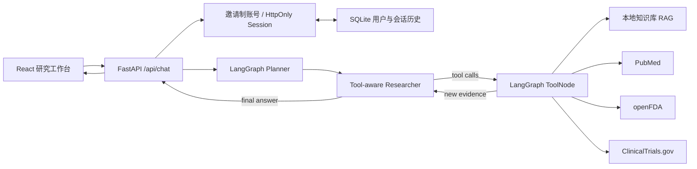

# BioCoder 2.0 — Self-Improving Biomedical Research Agent

面向药物研发知识检索与辅助分析的全栈 Agent。项目保留 **LangChain + LangGraph** 的
`LLM + RAG + Tool Calling` 工作流，并增加 Trajectory、Evaluation、Bad Case、训练数据、
Post-training、Regression Gate、Model Registry 与 Feedback 闭环。

> 本项目用于研发信息辅助，不构成诊断、治疗或处方建议。项目已提供邀请制账号与会话隔离；生产使用前仍应增加审计、传输/静态加密、模型评测和合规审查。

```text
Agent
  ↓
Trajectory
  ↓
Evaluation
  ↓
Bad Case
  ↓
Dataset
  ↓
Post-training
  ↓
Regression
  ↓
Deploy
  ↓
Agent
```

**BioCoder 不是简单 Chatbot，而是具备持续数据闭环和模型迭代能力的 Self-Improving Biomedical Research Agent。**

## 功能

- LangGraph 显式状态机：任务规划 → Agent 决策 → 工具调用 → 多轮检索 → 证据汇总
- 多轮会话：基于 `thread_id` 和 SQLite 持久化消息，重启后仍可恢复并继续追问
- 邀请制账号：邮箱/密码注册、HttpOnly 会话 Cookie，以及会话、附件、反馈和语义记忆的用户级隔离
- 本地 RAG：支持 `.md`、`.txt`、`.json`、`.pdf`、`.docx`，使用本地哈希向量或 OpenAI Embeddings + LangChain `InMemoryVectorStore`
- 多模态附件：对话可上传图片、PDF、DOCX 和文本；PDF 页面及 Word 内嵌图片可交给视觉模型分析
- 真实外部数据源：PubMed、openFDA 药品标签、ClinicalTrials.gov v2 API
- Tool Calling：模型按问题自动选择工具，可迭代修改检索策略
- 可追溯结果：API 返回分析计划、调用工具、结构化引用和原始链接
- 完整前后端：FastAPI + React/Vite/TypeScript，包含知识库上传与重建索引
- 三个可用工作区：Agent 对话、知识检索、证据审查；左侧支持历史会话加载与删除
- Docker Compose、本地开发脚本和基础测试
- 统一 Pydantic Agent State、`trace_id/task_id/session_id` 与 JSON/JSONL Trajectory
- Rule Evaluator + task rubric + 可选 LLM Judge + Human Feedback
- 自动 Bad Case 去重、质量门控 Data Flywheel、SFT/Preference 数据构建
- LoRA SFT/DPO 可执行入口与可验证 GRPO Reward scaffold
- Apple Silicon 原生 MLX 推理：Qwen3-VL-4B-Instruct 4-bit；文本模型保留独立 QLoRA SFT 路径
- Model Registry + 强制 Regression Gate；训练完成不等于允许上线
- OpenAI-compatible / vLLM Model Adapter、Token/Latency/Cost 追踪
- Tool Registry、权限分级、输入校验、密钥脱敏与 Loop Protection

## 架构



核心图仍定义在 `backend/app/agent/graph.py`。工具调用设有 `MAX_TOOL_ROUNDS` 上限；达到上限后会在工具结果已经返回、消息协议完整的前提下强制汇总。额外的 steps、retries、timeout、token 与 cost budgets 会以结构化失败停止执行。

## 快速启动

### 1. 配置模型

项目根目录已经预留 `.env`，填写：

```dotenv
OPENAI_API_KEY=sk-...
OPENAI_BASE_URL=https://api.openai.com/v1
LLM_MODEL=gpt-4o-mini
EMBEDDING_MODEL=text-embedding-3-small
AUTH_REGISTRATION_ENABLED=true
AUTH_INVITE_CODE=请设置私密邀请码
AUTH_ADMIN_EMAIL=管理员邮箱
AUTH_SESSION_DAYS=30
```

邀请码只在服务端环境变量中校验，不会下发到前端。注册页会使用 `AUTH_ADMIN_EMAIL` 生成邀请码申请邮件；生产环境还应设置 `APP_ENV=production`，让认证 Cookie 仅通过 HTTPS 发送。

也支持 OpenAI Chat Completions 兼容服务，只需修改 `OPENAI_BASE_URL`、模型名和 Key；聊天模型必须支持 Tool Calling。Embeddings 可以使用本地实现或单独的兼容端点。

使用 DeepSeek 等只提供聊天接口的兼容服务时，保持 `EMBEDDING_PROVIDER=auto` 即可自动使用本地哈希向量，不会把 OpenAI Embeddings 模型错误发送到聊天服务。若另有 OpenAI-compatible Embeddings 服务，可设置：

```dotenv
EMBEDDING_PROVIDER=openai
EMBEDDING_BASE_URL=https://your-embedding-service/v1
EMBEDDING_API_KEY=your-embedding-key
EMBEDDING_MODEL=text-embedding-3-small
```

DeepSeek 默认使用 `LLM_THINKING_MODE=disabled`，避免 Agent 的规划和工具选择阶段因长思考而阻塞；需要时可以改为 `enabled`。整条工作流受 `AGENT_TIMEOUT_SECONDS=90` 硬超时保护。

### 2. 本地开发

要求已安装 `uv` 和 Node.js 20+。`uv` 会自动准备项目所需的 Python 3.12，不要求系统存在 `python3.12` 命令：

```bash
cd projects/bioagent
make setup
```

如需改用 Python 3.11，可运行 `make setup PYTHON_VERSION=3.11`。虚拟环境统一创建在项目根目录的 `.venv` 中，不依赖当前 Shell 是否已激活其他 uv 环境。

首次安装依赖后，可以在一个终端同时启动前后端：

```bash
make dev
```

按 `Ctrl+C` 会同时关闭前端和后端。`exit` 用于退出 Shell，不是停止前台开发服务的命令。

也可以分别启动，终端一：

```bash
make backend
```

终端二运行 `make frontend`。分别启动时，需要在两个终端中各按一次 `Ctrl+C`。

浏览器打开 <http://localhost:5173>，API 文档位于 <http://localhost:8000/docs>。

### 3. Docker Compose

```bash
docker compose up --build
```

Docker 方式关闭服务使用 `docker compose down`，也可以运行 `make docker-down`。

前端仍访问 <http://localhost:5173>，后端为 <http://localhost:8000>。`backend/data` 以卷方式挂载，上传资料不会随容器重建丢失。

## 使用知识库

演示文档位于 `docs/examples/demo_knowledge.md`，不会参与正式检索。可通过前端上传资料，也可以直接把文件放到：

- `backend/data/knowledge/`：随代码维护的基础知识
- `backend/data/uploads/`：用户上传内容，默认被 Git 忽略

然后点击“重建索引”。索引当前驻留进程内存中，服务重启后会在第一次本地检索或手动重建时重新生成。这个设计无需额外数据库，适合本地演示和中小型资料集；生产环境建议替换为 pgvector、Qdrant、Milvus 或 Elasticsearch，并使用租户/文档级权限过滤。

可通过 `.env` 中逗号分隔的 `KNOWLEDGE_EXCLUDE_FILES` 排除 README、使用说明或临时文件；被排除的文件既不会进入 Agent 上下文，也不会出现在证据来源中。

## API

### 对话

```bash
curl -c biocoder.cookies -X POST http://localhost:8000/api/auth/register \
  -H 'Content-Type: application/json' \
  -d '{"display_name":"研究员","email":"name@example.com","password":"至少八位密码","invite_code":"管理员提供的邀请码"}'

curl -X POST http://localhost:8000/api/chat \
  -b biocoder.cookies \
  -H 'Content-Type: application/json' \
  -d '{"message":"分析 EGFR C797S 耐药机制","thread_id":null,"attachment_ids":[]}'
```

首次响应会返回 `thread_id`，后续请求带回同一个 ID 即可保持多轮上下文。

每条新生成的回答下方提供“有帮助 / 需要改进 / 1–5 分 / 补充改进”交互。评分和文字说明会进入
Feedback 数据；填写“更好的参考答案”时，数据飞轮会把用户答案作为 `chosen`、原回答作为
`rejected` 构建 DPO 偏好对。反馈数据只会落到已被 Git 忽略的 `backend/data/feedback/`。

### 其他接口

| 方法 | 路径 | 用途 |
|---|---|---|
| GET | `/api/auth/config` | 注册开关、邀请码要求和管理员邮箱 |
| POST | `/api/auth/register` | 使用邀请码创建账号并建立会话 |
| POST | `/api/auth/login` | 登录并建立 HttpOnly 会话 |
| GET | `/api/auth/me` | 获取当前账号 |
| POST | `/api/auth/logout` | 注销当前会话 |
| GET | `/api/health` | 服务、模型配置和索引状态 |
| POST | `/api/attachments` | 上传对话附件，返回可用于 Chat 的附件 ID |
| GET | `/api/knowledge` | 知识库文件与片段统计 |
| GET | `/api/knowledge/search` | 直接检索本地 RAG |
| POST | `/api/knowledge/upload` | 上传支持的知识文件，最大 15 MB |
| POST | `/api/knowledge/reindex` | 重建向量索引 |
| GET | `/api/conversations` | 历史会话列表 |
| GET | `/api/conversations/{thread_id}` | 恢复指定会话及引用 |
| DELETE | `/api/conversations/{thread_id}` | 删除本地会话 |
| POST | `/api/feedback` | 保存点赞、点踩、说明或用户修正答案 |
| GET | `/api/training/status` | 查看本地 SFT 后台任务状态（仅回环地址） |
| POST | `/api/training/sft` | 触发 dry-run 或真实本地 SFT（仅回环地址） |

## 测试

```bash
make test
```

无需 API Key 的测试会覆盖健康检查、输入校验、本地知识检索、SQLite 会话持久化，以及引用提取/去重。带真实模型的烟雾测试可在服务启动后使用上面的 `curl` 手工执行。

### RAG 离线评测

项目内置与正式知识库隔离的医药检索基准，包含 12 篇主题文档和 36 个同义改写问题。运行：

```bash
make eval
```

当前本地哈希向量方案的实测结果为：Top-1 检索准确率 **97.2%**、Recall@3/Recall@5 **100%**、MRR@5 **0.986**。完整逐题排名保存在 `backend/evaluation/results/retrieval_metrics.json`，汇总报告位于 `backend/evaluation/results/retrieval_metrics.md`。

上述结果衡量的是“标注证据是否被正确召回”，不是 LLM 生成答案的临床准确率。由于基准规模较小，报告同时提供 Top-1 准确率的 95% Wilson 置信区间；扩大知识库或更换 Embedding 后应重新运行，不应把该数字外推到生产数据。

## BioCoder 2.0 命令

以下 Python 命令从 `backend/` 运行；也可以使用后面的 Make targets：

```bash
# 运行 Agent（需要已配置 API 或 vLLM）
cd backend
../.venv/bin/python -m biocoder run --query "分析 EGFR C797S 耐药机制"

# 运行 24 条 Demo Agent Benchmark；无 predictions 时明确标记为 reference_baseline
../.venv/bin/python -m eval.runner --dataset eval/datasets/benchmark.jsonl

# 从真实 Trajectory + Feedback + Bad Case 自动构建版本化 Flywheel、SFT、Preference 数据
../.venv/bin/python -m data_flywheel.pipeline

# 默认均为 dry-run：只验证配置/数据并落盘元数据，不下载模型、不宣称训练完成
../.venv/bin/python -m training.sft.train --dataset /path/to/sft.jsonl
../.venv/bin/python -m training.dpo.train --dataset /path/to/preference.jsonl
../.venv/bin/python -m training.grpo.train --dataset /path/to/agent_trajectories.jsonl
```

上述通用 Transformers SFT/DPO 需要安装可选的 Transformers/TRL/PEFT/Accelerate 训练栈、
准备 GPU，并显式加入 `--execute`；Apple Silicon 的 MLX SFT 使用下一节的独立入口。GRPO 还需要
项目特定的 sandbox rollout adapter。Candidate 必须使用真实 prediction 运行离线 Benchmark 并
通过 Regression Gate，才可从 `candidate` 进入 `staging`。

### 16GB Apple Silicon 本地 Qwen3-VL 推理

本地多模态推理使用 `mlx-community/Qwen3-VL-4B-Instruct-4bit` 和 `mlx-vlm`。权重约
3.1 GB，下载固定版本后可由 `make dev` 与 FastAPI、前端一起管理：

```bash
make setup-vlm-mac
make download-qwen-vl
```

本地 `.env` 需要让服务端预加载路径与 Chat Completions 请求中的模型名保持一致：

```dotenv
OPENAI_BASE_URL=http://127.0.0.1:8080/v1
LLM_MODEL=backend/models/base/Qwen3-VL-4B-Instruct-4bit
MLX_AUTO_START=true
MLX_SERVER_MODULE=mlx_vlm.server
MLX_MODEL_PATH=backend/models/base/Qwen3-VL-4B-Instruct-4bit
```

也可单独运行 `make serve-mlx-vlm`。服务只监听 loopback，不应直接暴露到公网。前端输入框的
回形针按钮可添加图片、PDF、DOCX 和文本附件。图片及 PDF 页面以 OpenAI-compatible
`image_url` 内容块交给 Qwen3-VL；PDF/Word 同时抽取文本，扫描版 PDF 使用页面视觉输入。

### 16GB Apple Silicon 本地 Qwen SFT

这台 Mac 可以训练小模型，但应使用 LoRA/QLoRA，而不是全参数训练。仓库为
`mlx-community/Qwen3-4B-Instruct-2507-4bit` 提供了保守配置：batch size 1、1024 token、仅训练
最后 8 层的 Q/V LoRA、梯度累积 8、梯度检查点。这个模型是 MLX-LM 官方工具调用示例采用的
Qwen checkpoint；基础权重固定下载到已被 Git 忽略的
`backend/models/base/Qwen3-4B-Instruct-2507-4bit/`。这条训练路径与上面的 Qwen3-VL 推理
checkpoint 相互独立：

```bash
# 安装 Apple Silicon 原生训练依赖（只需一次）
make setup-training-mac

# 下载固定版本的 4-bit Qwen 权重；中断后可重复执行并续传
make download-qwen

# 先运行对话并收集反馈，再构建版本化数据
make flywheel

# 把下面路径替换为 make flywheel 输出版本目录中的 sft.jsonl
make sft-mac-dry SFT_DATASET=backend/data/datasets/<dataset-version>/sft.jsonl
make sft-mac SFT_DATASET=backend/data/datasets/<dataset-version>/sft.jsonl
```

基础权重下载量约 2.28GB，官方基准中的 4-bit 推理内存约 3.35GB；真实训练复用项目内权重，
并把 adapter、有效 MLX 配置和复现元数据写入
`backend/models/sft_mlx/version_*/`。训练完成状态是 `trained_unvalidated`，不会自动部署。

验证 adapter 后可启动本机 OpenAI-compatible 服务：

```bash
make serve-mlx MLX_ADAPTER=backend/models/sft_mlx/version_.../adapter
```

将 `.env.mlx.example` 中的值合并到本地 `.env` 后，`make dev` 会同时管理 MLX 模型服务、
FastAPI 和前端；若已经单独启动了同一端口的模型服务，开发脚本会复用它。进入 Agent 前仍须
运行 `make eval-agent` 并检查真实工具调用。MLX-LM 本地服务只监听 loopback，不应直接暴露到公网。

文本模型的 MLX 权重可以同时用于推理和官方 MLX-LM LoRA/QLoRA SFT；Qwen3-VL 不应直接套用
当前文本 SFT 配置。当前官方 MLX-LM 没有 DPO
训练入口，所以评分产生的 preference 数据会继续保留；仓库中的 DPO 执行器使用
Transformers/TRL 和未量化的 `Qwen/Qwen3-4B-Instruct-2507`，应在后续 GPU 服务器运行，不能把
“已采集 DPO 数据”误认为“本机已经完成 DPO”。

### 评分驱动的自主 SFT

普通 Chat Completions API 只能推理，不能直接修改本地 Qwen 权重。本项目的 FastAPI 提供的是
训练编排 API：评分先写入 Feedback；每累计 20 条新的正向评分后，后台构建版本化数据；只有
至少 20 条记录通过成功状态、无失败信号、质量分和负反馈门控时，才启动一次 MLX QLoRA。

```bash
# 查看任务状态
curl http://127.0.0.1:8000/api/training/status

# 手动只做数据/配置校验
curl -X POST http://127.0.0.1:8000/api/training/sft \
  -H 'Content-Type: application/json' \
  -d '{"execute":false}'

# 手动启动真实训练
curl -X POST http://127.0.0.1:8000/api/training/sft \
  -H 'Content-Type: application/json' \
  -d '{"execute":true}'
```

训练 API 拒绝非回环地址，同时只允许一个后台任务。自动训练有 24 小时冷却时间。训练结果保持
`trained_unvalidated`，不会自动替换当前 Agent 模型；必须经过回归评测后再人工部署。

```bash
# 在项目根目录
make eval-agent
make eval-rag
make flywheel
make sft-mac-dry SFT_DATASET=backend/data/datasets/<dataset-version>/sft.jsonl
make lint
make test
```

详细说明见：`docs/ARCHITECTURE.md`、`docs/DATA_FLYWHEEL.md`、`docs/EVALUATION.md`、
`docs/POST_TRAINING.md`、`docs/DEPLOYMENT.md`、`docs/SECURITY.md`。

## 目录结构

```text
bioagent/
├── .env                         # 本地凭证（已忽略）
├── .env.example                 # 配置模板
├── docker-compose.yml
├── Makefile
├── backend/
│   ├── app/
│   │   ├── agent/graph.py       # LangGraph 工作流
│   │   ├── rag/store.py         # 文件加载、切分、向量检索
│   │   ├── tools/research.py    # 四个 LangChain tools
│   │   ├── services/llm.py      # 模型与 Embeddings 工厂
│   │   ├── services/history.py  # SQLite 会话持久化
│   │   └── main.py              # FastAPI
│   ├── biocoder/                 # State、Trajectory、Memory、Security、CLI
│   ├── observability/            # Structured Trace 与 Cost
│   ├── eval/                     # Agent Benchmark、Evaluator、Regression Gate
│   ├── feedback/                 # 统一反馈 schema/store
│   ├── data_flywheel/            # 过滤、去重、质量与版本化
│   ├── training/                 # Dataset Builders、SFT/DPO/GRPO
│   ├── model_registry/           # Candidate/Staging/Production/Rejected
│   ├── inference/                # ModelProvider 与 vLLM client
│   ├── data/knowledge/
│   └── tests/{unit,integration,e2e}/
└── frontend/
    ├── src/
    │   ├── components/
    │   ├── lib/api.ts
    │   └── App.tsx
    └── package.json
```

## 生产化建议

1. 将本地 SQLite 账号/会话存储替换为 Postgres，并增加集中审计、静态加密和统一过期策略。
2. 使用持久化向量数据库并记录文档版本、权限、数据血缘和删除状态。
3. 为 PubMed 等外部接口加缓存、速率限制、熔断与后台队列。
4. 建立黄金问题集，评测检索召回率、引用正确性、事实一致性、工具选择和拒答边界。
5. 增加 SSO/RBAC、加密、审计日志、提示词注入防护和敏感数据脱敏。
6. 对关键药物结论设置人工审核，保留原始证据快照和生成模型版本。
