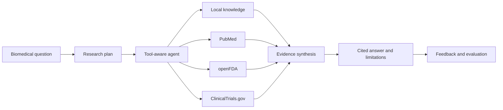
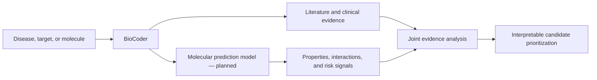

# BioCoder

### Evidence-grounded biomedical research agent

BioCoder is an AI research workspace for biomedical questions, drug research, and evidence synthesis. It turns a natural-language question into a structured research plan, searches relevant scientific and regulatory sources, and produces a concise answer with traceable citations and explicit uncertainty.

The current system focuses on evidence-based medical research. A future molecular prediction model will extend BioCoder toward computational drug discovery by connecting molecular predictions with literature, pharmacology, and clinical evidence.

> BioCoder is a research-support system. It does not provide personalized diagnosis, treatment, or prescribing advice and must not replace qualified medical or scientific judgment.

## Current capabilities

- Answers questions about diseases, drugs, genes, targets, mechanisms, safety, and clinical development.
- Creates a research plan and selects evidence tools through a LangGraph workflow.
- Searches multiple sources in one task and adjusts queries from intermediate results.
- Combines public evidence with private local documents and user-provided attachments.
- Returns source links, numbered citations, evidence summaries, and stated limitations.
- Supports multi-turn conversations, history, attachment analysis, and evidence review.
- Records agent trajectories and user feedback for evaluation and future model improvement.

## Evidence sources

| Source | Purpose | Status |
|---|---|---|
| PubMed | Biomedical literature, abstracts, journals, authors, and PMIDs | Available |
| openFDA | Drug indications, warnings, adverse reactions, dosage, and pharmacology | Available |
| ClinicalTrials.gov | Trial status, phase, enrollment, and study summaries | Available |
| Local RAG | Private research documents and internal knowledge | Available |
| User attachments | PDF, DOCX, text, JSON, and image analysis | Available |
| Additional biomedical databases | Broader structured evidence coverage | Planned |

Local retrieval supports Markdown, text, JSON, PDF, and Word documents. Public and private evidence can be used in the same research task while retaining their source identity.

## Research workflow

BioCoder distinguishes retrieved facts, model inference, conflicting evidence, and insufficient evidence. Tool permissions, input validation, timeouts, execution budgets, and loop protection constrain the workflow.

## System design

| Component | Role |
|---|---|
| LangGraph agent | Planning, tool selection, iterative retrieval, and synthesis |
| Local RAG | Document extraction, chunking, embeddings, and semantic retrieval |
| Research tools | PubMed, openFDA, and ClinicalTrials.gov integration |
| FastAPI backend | Chat, authentication, attachments, knowledge, history, and feedback APIs |
| React workspace | Conversation, knowledge search, and evidence review interface |
| Evaluation layer | Trajectory recording, rule evaluation, optional LLM judging, and regression gates |
| Data flywheel | Feedback filtering, bad-case analysis, and training dataset construction |
| Model registry | Candidate model tracking and controlled promotion |

The repository includes SFT and DPO entry points and a GRPO reward scaffold. Training completion does not imply deployment approval: candidate models must pass regression evaluation and human review before promotion.

## Roadmap: scientific multimodal chromatography

BioCoder is planning an LC-MS multimodal workflow under the public project name `ChromPeakFormer`. The proposed system combines extracted-ion chromatogram images, RT-intensity sequences, transition metadata, a specialist peak-analysis tool, and a domain-adapted Qwen3-VL model.

This roadmap is explicitly evidence-gated: tool integration, Qwen3-VL LoRA training, numerical-signal fusion, scientific evaluation, and public metric claims are treated as separate milestones. Planned work is not presented as completed capability.

- [Multimodal architecture and implementation roadmap](MULTIMODAL_ROADMAP.md)
- [Verification, leakage-control, and ablation plan](MULTIMODAL_TEST_PLAN.md)

## Roadmap: molecular drug prediction

The next major stage is a dedicated molecular prediction capability. This work is planned and is not part of the current production feature set.

Planned directions include:

- Molecular input and representation using SMILES or standardized compound identifiers.
- Physicochemical, drug-likeness, and ADMET-related property prediction.
- Compound-target interaction and disease-target association analysis.
- Multi-factor candidate prioritization using prediction scores and external evidence.
- Confidence, applicability-domain, and model-version reporting for each prediction.
- Agent tools that connect computational predictions to supporting or conflicting literature and clinical evidence.

Predictions will be treated as research signals rather than established facts. Experimental, pharmacological, toxicological, and clinical validation will remain necessary.

## Scope and limitations

- Public retrieval currently covers PubMed, openFDA, and ClinicalTrials.gov rather than every biomedical database.
- Results depend on source availability, query quality, index coverage, and the quality of the original evidence.
- Generated summaries may contain omissions or interpretation errors; important conclusions should be checked against primary sources.
- The current local knowledge index is intended for research and moderate document collections, not unmodified production deployment.
- Production use requires stronger auditing, encryption, access control, persistent infrastructure, compliance review, and domain-specific validation.
- Molecular prediction is a future capability and must not be described as currently deployed.

## Vision

BioCoder aims to shorten the path from a biomedical question to verifiable evidence. Today it provides an evidence-centered medical research workflow; over time, it is intended to connect disease and target knowledge, molecular prediction, candidate prioritization, and clinical evidence within one explainable and evaluable agent.
