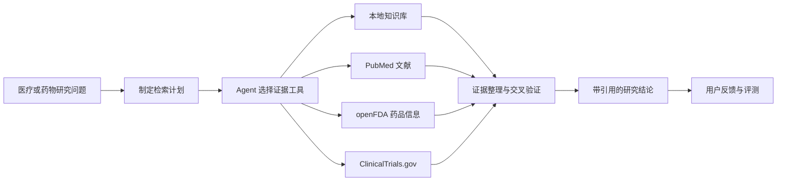

# BioCoder

## 循证医疗研究与分子药物智能 Agent

BioCoder 是一个面向医疗研究、药物研发和生物医药知识分析的智能 Agent。
它将自然语言医疗问题转化为可执行的证据检索任务，自动查找医学文献、药品信息、
临床试验和本地研究资料，并将不同来源的内容整理为带引用、可追溯且明确说明局限性的研究结论。

项目当前聚焦于“循证医疗信息检索与综合分析”，未来将进一步融合分子药物预测模型，
使 Agent 能够在同一工作流中连接医学知识、临床证据与计算药物发现能力。

> BioCoder 是研发与科研信息辅助系统，不构成个体化诊断、治疗或处方建议，
> 也不能替代医生、药师、临床研究人员或其他专业人员的判断。

## 项目愿景

生物医药研究通常需要在论文、药品标签、临床试验注册信息和内部资料之间反复检索、
交叉验证与归纳。不同来源使用的术语、证据等级和数据结构并不一致，研究人员往往需要投入
大量时间才能形成一份可核查的初步判断。

BioCoder 希望构建一个统一的智能研究入口：

- 让用户直接使用自然语言提出疾病、药物、靶点、机制或临床试验相关问题。
- 让 Agent 自主规划检索步骤，并根据中间结果调整查询策略。
- 让每项关键结论都尽可能对应到可访问的原始证据。
- 明确区分已检索事实、模型推断、证据冲突与证据不足。
- 将未来的分子预测结果与已有文献、药理信息和临床证据放在同一分析上下文中。
- 通过反馈、评测和回归门控持续改进系统，同时保留人工审核边界。

## 当前能力

### 医疗与药物问题分析

BioCoder 可以围绕疾病、药物、基因、靶点、作用机制、安全性和临床研究等主题进行查询。
系统不会只返回一个脱离来源的答案，而是先形成检索计划，再调用适合的数据工具，最后汇总为
包含结论、证据、来源和不确定性的研究结果。

适合的研究问题包括：

- 某种疾病相关的关键靶点、通路与研究进展。
- 某种药物的适应证、作用机制、警告和不良反应。
- 特定突变或耐药机制的文献证据。
- 某个疾病、靶点或候选药物相关的临床试验进展。
- 多项研究结论之间的一致性、差异与证据缺口。
- 用户上传的研究资料与公开证据之间的联合分析。

### 多源证据检索

当前版本已接入以下证据来源：

| 来源 | 主要用途 | 当前状态 |
|---|---|---|
| PubMed | 检索生物医学论文、摘要、作者、期刊和 PMID | 已实现 |
| openFDA | 检索药品适应证、警告、不良反应、剂量和药理信息 | 已实现 |
| ClinicalTrials.gov | 检索临床试验状态、分期、入组规模和研究概要 | 已实现 |
| 本地知识库 | 检索团队内部文档、研究笔记和私有资料 | 已实现 |
| 用户附件 | 分析 PDF、Word、文本、JSON 和图片等对话资料 | 已实现 |
| 其他专业数据库 | 扩展更多结构化生物医药数据源 | 规划中 |

本地知识库使用 RAG 检索，可处理 `.md`、`.txt`、`.json`、`.pdf` 和 `.docx` 文件。
公开来源和私有资料可以在同一轮研究任务中被组合使用，但回答会保留各自的来源标识。

### 可追溯的研究结果

BioCoder 的回答强调证据来源，而不是只给出模型生成的结论。系统可以返回：

- 面向用户展示的检索与分析计划。
- Agent 实际调用的数据工具。
- 论文、药品标签和临床试验的原始链接。
- 与结论对应的编号引用和证据摘要。
- 对证据不足、工具失败、信息冲突和推断成分的说明。

### 多轮研究工作区

系统提供基于 React 与 FastAPI 的研究工作区，支持多轮对话、历史会话、知识库管理、
附件分析和证据审查。用户可以围绕上一轮答案继续追问，也可以上传自己的研究材料，
让 Agent 在当前研究上下文中进行补充分析。

邀请制账号、会话 Cookie 和用户级数据隔离用于保护不同用户的会话、附件、反馈和记忆数据。
这些能力适合本地研发和受控环境，但尚不能替代完整的生产级合规体系。

### 反馈与持续改进闭环

BioCoder 不仅包含问答流程，还提供面向模型迭代的数据闭环：

```text
研究问题 → Agent 轨迹 → 结果评测 → 用户反馈
        → Bad Case → 训练数据 → 候选模型 → 回归评测
```

当前代码包含轨迹记录、规则评测、可选 LLM Judge、用户反馈、Bad Case 管理、训练数据构建、
SFT/DPO 入口、模型注册和回归门控。训练完成只代表产生了候选模型；候选模型必须经过评测和
人工确认后，才能进入后续部署阶段。

## Agent 工作流程



该流程由 LangGraph 状态图驱动。Agent 可以在一轮任务中连续调用多个工具，观察中间结果后
修改检索词，并在预算、超时和最大工具轮数限制内完成证据汇总。

## 未来方向：融合分子药物预测模型

BioCoder 的下一阶段目标是加入用于分子与药物预测的专用模型。该部分目前属于研发规划，
尚未作为现有生产能力提供。

计划中的能力包括：

### 分子表征与性质预测

- 接收 SMILES、分子结构或标准化化合物标识。
- 生成适合下游任务的分子表示。
- 预测基础理化性质、成药性指标以及与 ADMET 相关的风险信号。
- 输出预测置信度、适用域和模型版本，避免把单次模型输出视为确定事实。

### 靶点与药物相互作用分析

- 预测候选分子与生物靶点之间的潜在关联或相互作用。
- 将预测结果与靶点机制、疾病背景和既有药物证据联合解释。
- 检索支持或反驳预测结果的论文、药品资料与临床试验。

### 候选药物优先级排序

- 综合分子预测指标、公开证据、临床阶段、安全性和研究可行性。
- 对候选分子进行多维度比较，而不是只依赖单一模型分数。
- 为每个候选结果展示模型依据、外部证据、冲突信息和待验证假设。

### Agent 与预测模型的融合


融合后的预测模型将作为受权限、输入验证、超时和版本控制约束的 Agent 工具接入，
而不是绕过证据流程直接生成药物结论。系统将把计算预测视为一种需要实验与临床证据验证的
研究信号，并记录模型版本、输入、输出和评测结果。

## 系统组成

| 模块 | 作用 |
|---|---|
| LangGraph Agent | 规划任务、选择工具、迭代检索并生成结论 |
| 本地 RAG | 对私有知识文件进行切分、向量检索和证据返回 |
| Research Tools | 连接 PubMed、openFDA 和 ClinicalTrials.gov |
| FastAPI 服务 | 提供对话、认证、附件、知识库、历史和反馈接口 |
| React 工作区 | 提供对话、知识检索和证据审查界面 |
| Trajectory & Evaluation | 记录执行过程并评测工具选择与回答质量 |
| Data Flywheel | 从反馈和 Bad Case 构建经过过滤的数据集 |
| Model Registry | 管理候选模型状态与回归门控 |
| Molecular Prediction | 分子性质与药物预测能力，规划中 |

## 设计原则

1. **证据优先**：医疗、药物和临床事实优先通过工具检索，不依赖无来源的模型记忆。
2. **来源可追溯**：关键结论应尽可能关联原始论文、药品信息或临床试验页面。
3. **事实与预测分离**：明确区分已知事实、模型推断、计算预测和待验证假设。
4. **安全边界明确**：不提供个体化诊疗或处方，不把研究信息包装成临床决策。
5. **数据最小化**：本地环境文件、用户附件、数据库、模型权重和运行数据不进入代码仓库。
6. **评测先于部署**：新模型和新工具需要经过确定性测试、回归评测与人工审核。
7. **渐进式扩展**：在保留现有医疗证据工作流的基础上逐步加入新的数据库和预测模型。

## 当前边界

- 公开证据检索目前集中于 PubMed、openFDA 和 ClinicalTrials.gov，不代表覆盖所有医学网站或数据库。
- 检索结果受外部接口可用性、索引范围、查询词和原始数据质量影响。
- 模型生成的总结可能存在遗漏或解释偏差，重要结论必须回到原始来源核查。
- 当前本地知识索引适合研发与中小规模资料集，生产部署仍需要更完整的权限、审计和持久化方案。
- 分子药物预测模型尚在规划与构建阶段，当前系统不应被描述为已具备候选药物发现或临床预测能力。
- 所有计算预测在未来接入后仍需通过实验、药理、毒理和临床研究验证。

## 项目定位

BioCoder 的目标不是替代研究人员，而是缩短从“提出问题”到“获得可核查证据”的路径。
当前系统提供循证医疗研究的智能检索与综合分析基础；未来通过融合分子药物预测模型，
项目将进一步探索从疾病与靶点知识、候选分子计算预测到文献和临床证据验证的一体化研究流程。

最终愿景是形成一个可信、可解释、可评测并能持续迭代的生物医药研究 Agent，
为早期药物发现和医疗科研提供高质量的信息与计算支持。
